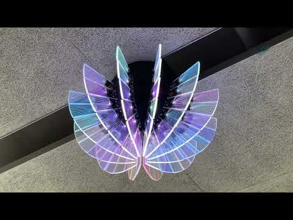
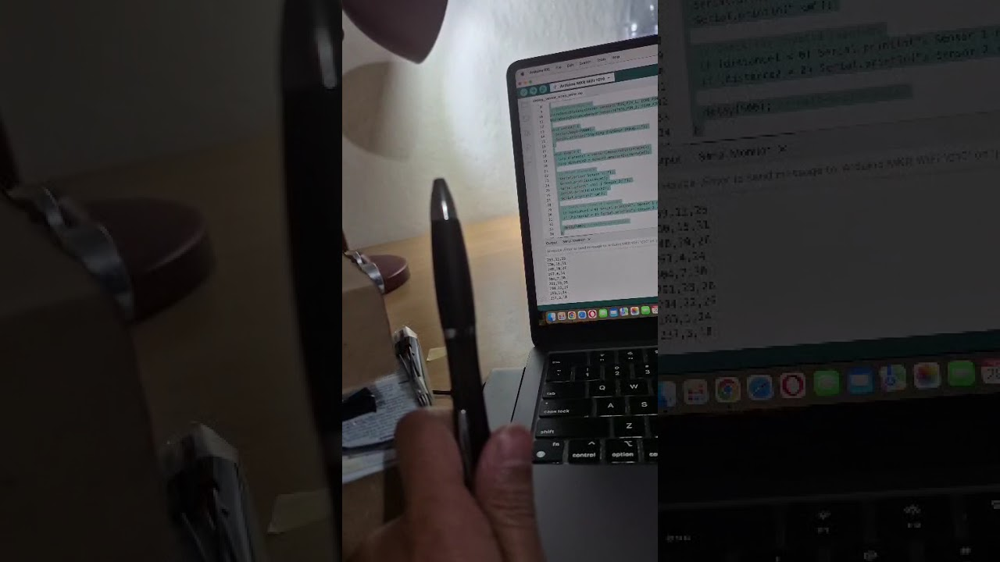

# 🌙 Vespera: 360° Spatial Radar Luminaire with Color Mapping


**Author:** Gilang Pamungkas  
**Course:** CASA0014 – Prototyping the Internet of Things (UCL)  
**Year:** 2025  

---

## ✨ Concept

**Vespera** — derived from the Latin word for “evening” — represents the *moment when a single point of light emerges in twilight*, symbolizing the passage of time and transition from day to night.  

This project reimagines Vespera as an interactive 360° luminaire, inspired by the flower-shaped Vespera installation in our lab and the immersive experience of virtual museum tours. Using dual ultrasonic sensors, the system detects a visitor’s spatial position and motion, translating these readings into dynamic color gradients across 72 NeoPixels.



The luminaire creates a virtual “secret flower garden”, where different zones correspond to specific flower types: moving through the “rose” area turns the light red, passing through the “lavender” area glows soft purple, and each area generates a distinct interplay of color. This mapping allows visitors to explore the installation interactively, with each movement shaping a personalized, immersive visual experience.

Sensor data are transmitted via MQTT to a broker, enabling remote visualization through web interfaces or integration with the original Vespera installation.

🚀 See the project come to life! Watch the demo on Youtube here: [](https://www.youtube.com/shorts/9bAf2ExGNtA)


---

## 🧩 System Overview

This repository builds on the CASA0014 workshop ecosystem, extending its functionality with a servo-based scanning mechanism.

| Component | Description |
|------------|-------------|
| **Vespera Luminaire (Arduino MKR1010)** | Central light installation receiving RGB color data via MQTT and displaying them on 72 LEDs. |
| **Dual Ultrasonic Scanner (This Project)** | A WiFi-enabled Arduino controller that measures distance from two ultrasonic sensors during a servo sweep, maps readings to colors, and publishes to MQTT topic `student/CASA0014/luminaire/[id]`. |
| **MQTT Broker** | `mqtt.cetools.org` — central communication hub between controllers, visualisers, and the Vespera installation. |
| **Web Visualiser** | Browser-based interface that subscribes to the same MQTT topics and mirrors the LED colors in real time. |


---

## 🛠️ Features

- **WiFi-enabled MQTT publishing**
- **Dual ultrasonic ranging (HCSR04)**
- **Servo-based 180° scanning**
- **Dynamic color mapping** based on distance and angle
- **Full payload replication** for compatibility with CASA0014 Vespera
- **Reproducible, open-source hardware and code**

---

## 🗂️ Repository Contents

---
```text
Vespera/
|-- src/
|   |-- secret_flower_garden.ino       # Main Arduino sketch
|   |-- arduino_secrets_template.h     # Safe template for credentials
|   |-- images/
|       |-- prototype.jpg              # Project photo
|       |-- wiring.png                  # Circuit wiring
|       |-- color_mapping.png           # Color logic diagram
|       |-- demo.gif                    # Demo animation
|-- .gitignore
|-- LICENSE
|-- README.md
```
---

## ⚙️ Hardware Setup

| Component | Model | Role |
|------------|--------|------|
| Microcontroller | Arduino MKR WiFi 1010 | WiFi + MQTT client |
| Servo Motor | SG90 | Sweeps dual sensors 0°–180° |
| Ultrasonic Sensors | HC-SR04 (x2) | Measure distance |
| LEDs | WS2812 (72 NeoPixels) | Color output |
| Power | 5V regulated | Supply for all modules |

**Pin configuration** (defined in code):  
- Servo: D2  
- Ultrasonic #1: Trig D6 / Echo D7  
- Ultrasonic #2: Trig D5 / Echo D4  

---

## 📡 System Architecture

[Dual HCSR04 + Servo] → [Arduino MKR1010] → MQTT → [Broker: mqtt.cetools.org]
↳ Web Visualiser
↳ Vespera Light Installation

The Arduino sweeps the sensors using a servo motor.  
For every 10-second cycle, it identifies the **shortest detected distance** and **corresponding angle**, converts these into an RGB value via a 32-color lookup table, and publishes that color array (216 bytes) to its MQTT topic.

---

## 💡 Color Mapping Logic

Each color corresponds to a distance–angle bin:

| Parameter | Range | Bin Size | Notes |
|------------|--------|-----------|-------|
| Angle | 0–180° | 30° | 6 bins |
| Distance | 0–60 cm | 10 cm | 6 bins |
| Total colors | 6 × 6 = 36| RGB-coded |

Example mapping:

| Distance | Angle | Color |
|-----------|--------|-------|
| 0–10 cm | 0–30° | Red |
| 10–20 cm | 30–60° | Orange |
| 20–30 cm | 60–90° | Green |
| 30–40 cm | 90–120° | Cyan |
| >40 cm | 120–180° | Blue–Violet |

Visual logic diagram:  


---

## 🧠 How It Works (Step-by-Step)

1. **Startup:** Connects to stored Wi-Fi networks, then the MQTT broker.  
2. **Initialization:** Servo resets to 0°, LEDs flash blue.  
3. **Sweep:** Servo pans 0°–180°–0° while both sensors measure distances.  
4. **Computation:** Closest object + angle → color index → RGB array.  
5. **Publish:** RGB payload (72 × 3 bytes) sent to MQTT topic.  
6. **Visualisation:** Seen live on Vespera or via the web visualiser.  

---

## 💬 MQTT Topic and Payload

**Topic format:**
student/CASA0014/luminaire/[lightId]

**Payload structure:**  
Binary byte array: `[R1,G1,B1, R2,G2,B2, … R72,G72,B72]`  

Example colors:
| Color | RGB Decimal | Hex Bytes |
|--------|--------------|-----------|
| Red | 255,0,0 | FF 00 00 |
| Green | 0,255,0 | 00 FF 00 |
| Blue | 0,0,255 | 00 00 FF |
| White | 255,255,255 | FF FF FF |

---

## 🧩 Installation Guide

### 1. Prerequisites
- Arduino IDE  
- Libraries:  
  - `WiFiNINA`  
  - `PubSubClient`  
  - `Servo`  
  - `HCSR04`  

### 2. Setup
1. Clone this repository.  
2. Duplicate and rename the template:
   ```bash
   cp src/arduino_secrets_template.h src/arduino_secrets.h
3.	Add your Wi-Fi and MQTT credentials.
4.	Connect your Arduino and upload secret_flower_garden.ino.
5.	Open Serial Monitor (9600 baud) to view live data.
 
🧰 Testing Options
🔵 On Real Vespera
Use the Selector Dial in CASA0014 lab to pick your ID number (1–40).
Vespera will subscribe to your unique topic.
🌐 On Web Visualiser
Open the provided web visualiser HTML and set the same topic:
student/CASA0014/luminaire/[yourId]
You’ll see the color data appear in real time.
 
🧩 Troubleshooting
Symptom	Possible Cause	Fix
No WiFi connection	Wrong SSID/password	Check arduino_secrets.h
MQTT not connecting	Broker offline or wrong port	Verify mqtt.cetools.org:1884
LEDs stay off	Power issue or NeoPixel wiring	Recheck 5 V and data pin
Servo jitter	Insufficient current	Use external 5 V supply
Web visualiser blank	Wrong topic	Match topic to Arduino lightId
 
🧠 Reproducibility & Open Source Practice
•	All code and hardware configurations are clearly commented and structured for independent replication.
•	Private credentials are safely excluded via .gitignore.
•	Project is released under the MIT License for educational and research reuse.
•	Compatible with CASA0014 ecosystem for collaborative testing and visualization.
 
📜 License
This project is released under the MIT License.
 
📚 Citation
Pamungkas, G. (2025). Vespera: Connected Luminaire with Dual Ultrasonic Sensing and MQTT Control.
UCL CASA0014 – MSc Connected Environments.
 
🙏 Acknowledgements
•	UCL CASA teaching team for the original Vespera framework
•	Open-source communities of Arduino, PubSubClient, and WiFiNINA
•	Classmates and collaborators in CASA0014 workshops
 
🖼️ Project Gallery
Example	Description
    Fully assembled prototype
    Component wiring
    Working demo of color sweep
