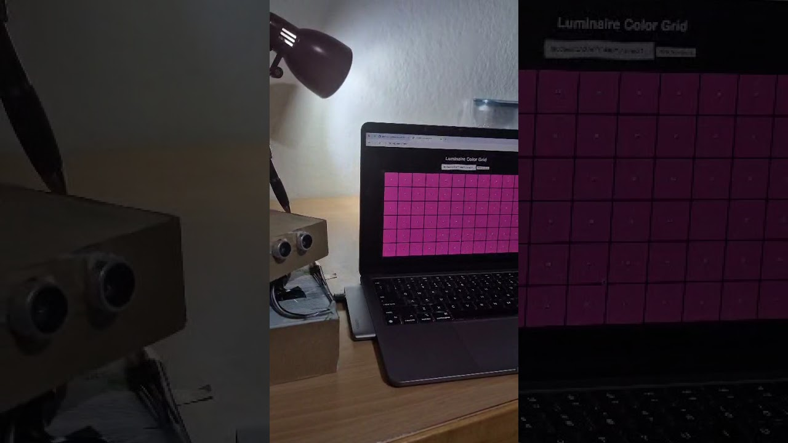
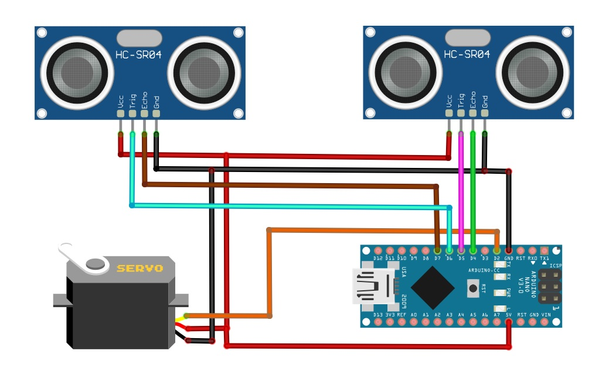
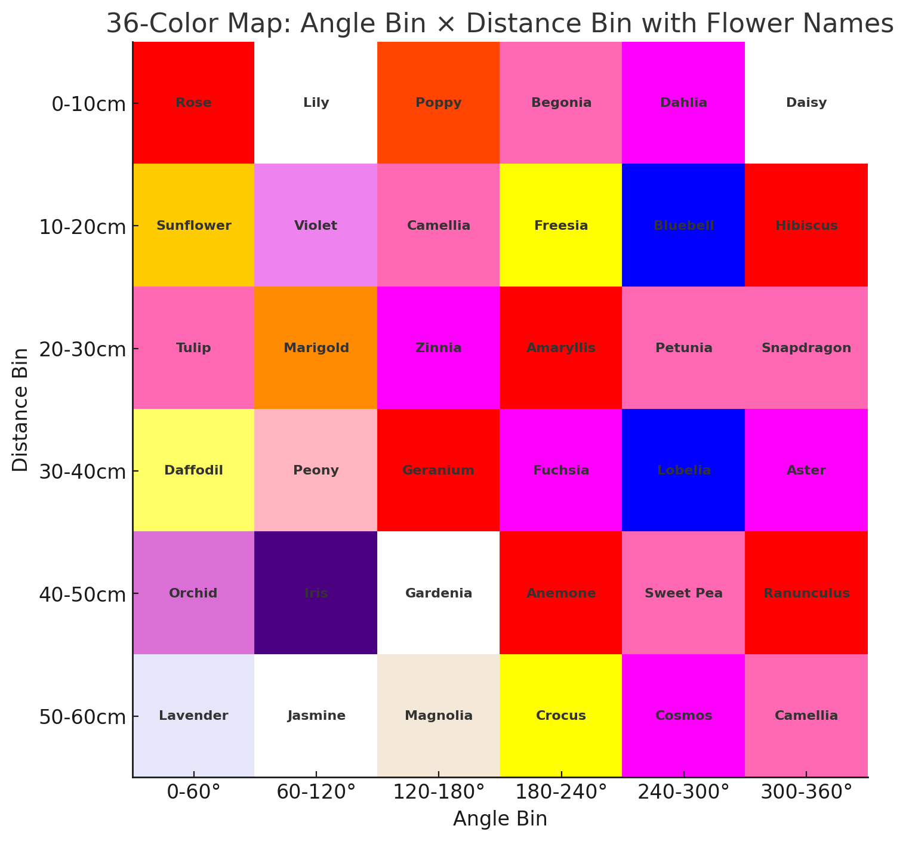

# 🌷 Secret Flower Garden: A 360° Spatial Light Experience


**Author:** Gilang Pamungkas  
**Course:** CASA0014 – Prototyping the Internet of Things (UCL)  
**Year:** 2025  

---

## ✨ Concept

**Vespera** — derived from the Latin word for “evening” — represents the *moment when a single point of light emerges in twilight*, symbolizing the passage of time and transition from day to night.  

This project reimagines Vespera as an interactive 360° luminaire, inspired by the flower-shaped Vespera installation in our lab and the immersive experience of virtual museum tours. Using dual ultrasonic sensors, the system detects a visitor’s spatial position and motion, translating these readings into dynamic color gradients across 72 NeoPixels.


The luminaire creates a virtual “secret flower garden”, where different zones correspond to specific flower types: moving through the “rose” area turns the light red, passing through the “lavender” area glows soft purple, and each area generates a distinct interplay of color. This mapping allows visitors to explore the installation interactively, with each movement shaping a personalized, immersive visual experience.

Sensor data are transmitted via MQTT to a broker, enabling remote visualization through web interfaces or integration with the original Vespera installation.

🚀 See the project come to life! Watch the demo on Youtube here: [](https://www.youtube.com/shorts/9bAf2ExGNtA)
[](https://www.youtube.com/shorts/MIEOaTj03PA)


---

## 🧩 System Overview

This repository builds on the CASA0014 workshop ecosystem, extending its functionality with a servo-based scanning mechanism.

| Component | Description |
|------------|-------------|
| **Vespera Luminaire (Arduino MKR1010)** | Central light installation receiving RGB color data via MQTT and displaying them on 72 LEDs. |
| **Dual Ultrasonic Scanner (This Project)** | A WiFi-enabled Arduino controller that measures distance from two ultrasonic sensors during a servo sweep, maps readings to colors, and publishes to MQTT topic `student/CASA0014/luminaire/[id]`. |
| **MQTT Broker** | `mqtt.cetools.org` — central communication hub between controllers, visualisers, and the Vespera installation. |
| **Web Visualiser** | Browser-based interface that subscribes to the same MQTT topics and mirrors the LED colors in real time. |


---

## 🛠️ Features

- **WiFi-enabled MQTT publishing**
- **Dual ultrasonic ranging (HCSR04)**
- **Servo-based 180° scanning**
- **Dynamic color mapping** based on distance and angle
- **Full payload replication** for compatibility with CASA0014 Vespera
- **Reproducible, open-source hardware and code**

---

## 🗂️ Repository Contents

---
```text
Vespera/
|-- src/
|   |-- secret_flower_garden.ino       # Main Arduino sketch
|   |-- arduino_secrets_template.h     # Safe template for credentials
|   |-- images/
|       |-- flower_garden_map.png              # color mapping
|       |-- sensor_demo.jpg                  # thumbnail video demo
|       |-- vespera.jpeg           # vespera light installation
|       |-- web_visualization.jpg                   # Animation demo on web
|       |-- wiring.jpg                    # project wiring
|-- .gitignore
|-- LICENSE
|-- README.md
```
---

## ⚙️ Hardware Setup

| Component | Model | Role |
|------------|--------|------|
| Microcontroller | Arduino MKR WiFi 1010 | WiFi + MQTT client |
| Servo Motor | SG90 | Sweeps dual sensors 0°–180° |
| Ultrasonic Sensors | HC-SR04 (x2) | Measure distance |
| LEDs | WS2812 (72 NeoPixels) | Color output |
| Power | 5V regulated | Supply for all modules |

**Pin configuration** (defined in code):  
- Servo: D2  
- Ultrasonic #1: Trig D6 / Echo D7  
- Ultrasonic #2: Trig D5 / Echo D4  



---

## 📡 System Architecture

[Dual HCSR04 + Servo] → [Arduino MKR1010] → MQTT → [Broker: mqtt.cetools.org]
↳ Web Visualiser
↳ Vespera Light Installation

The Arduino sweeps the sensors using a servo motor.  
For every 10-second cycle, it identifies the **shortest detected distance** and **corresponding angle**, converts these into an RGB value via a 36-color lookup table, and publishes that color array (216 bytes) to its MQTT topic.

---

## 🌸 Spatial Color Mapping — *Secret Flower Garden Logic*

Each flower color corresponds to a **distance–angle bin pair**, derived from **two ultrasonic sensors (0–360° coverage)** and **6×6 mapping bins**.  
The luminaire uses this system to transform spatial data into a dynamic color composition — a “Secret Flower Garden” of light.

| Parameter | Range | Bin Size | Notes |
|------------|--------|-----------|-------|
| **Angle** | 0–360° | 60° | 6 bins (2 sensors × 180° sweep) |
| **Distance** | 0–60 cm | 10 cm | 6 bins |
| **Total Colors** | 6 × 6 = 36 | RGB-coded (each mapped to a flower) |

### 🌷 Example Mapping Table

| Angle Bin (°) | Distance Bin (cm) | Example Flower | Color (RGB) |
|----------------|-------------------|----------------|--------------|
| 0–60° | 0–10 | Rose | (255, 0, 0) |
| 60–120° | 10–20 | Sunflower | (255, 204, 0) |
| 120–180° | 20–30 | Tulip | (255, 105, 180) |
| 180–240° | 30–40 | Daffodil | (255, 255, 102) |
| 240–300° | 40–50 | Orchid | (218, 112, 214) |
| 300–360° | 50–60 | Lavender | (230, 230, 250) |

Each bin corresponds to one of the **36 floral tones** defined in the Arduino `colorMap[]`.  
During a full sweep:

- 🌼 Two ultrasonic sensors capture **distance and angle** data (0–360° field).  
- 🌿 The nearest detected object determines the **active flower zone color**.  
- 💡 The selected RGB value is published via **MQTT** to the luminaire.

The following image illustrates the 6×6 color mapping between distance and angle bins, each represented by a specific flower tone.


---


## 🧠 How It Works (Step-by-Step)

1. **Startup:** Connects to stored Wi-Fi networks, then the MQTT broker.  
2. **Initialization:** Servo resets to 0°, LEDs flash blue.  
3. **Sweep:** Servo pans 0°–180°–0° while both sensors measure distances.  
4. **Computation:** Closest object + angle → color index → RGB array.  
5. **Publish:** RGB payload (72 × 3 bytes) sent to MQTT topic.  
6. **Visualisation:** Seen live on Vespera or via the web visualiser.  

---

## 💬 MQTT Topic and Payload

**Topic Format:**  
`student/CASA0014/luminaire/[lightId]`

**Payload Structure:**  
Binary byte array: `[R1,G1,B1, R2,G2,B2, … R72,G72,B72]`

Each RGB triplet represents one light segment corresponding to a flower color zone.

### 🌼 Example Flower Colors

| Flower | RGB (Decimal) | Hex Bytes |
|---------|----------------|-----------|
| Rose (Red) | 255, 0, 0 | FF 00 00 |
| Lavender (Purple) | 150, 123, 182 | 96 7B B6 |
| Sunflower (Yellow) | 255, 223, 0 | FF DF 00 |
| Hydrangea (Blue) | 96, 150, 255 | 60 96 FF |
| Jasmine (White) | 255, 255, 255 | FF FF FF |

---

## 🧩 Installation Guide

### 1. Prerequisites
- Arduino IDE  
- Libraries:  
  - `WiFiNINA`  
  - `PubSubClient`  
  - `Servo`  
  - `HCSR04`  

### 2. Setup
1. Clone this repository.  
2. Duplicate and rename the template:
   ```bash
   cp src/arduino_secrets_template.h src/arduino_secrets.h
3.	Add your Wi-Fi and MQTT credentials.
4.	Connect your Arduino and upload secret_flower_garden.ino.
5.	Open Serial Monitor (9600 baud) to view live data.
 
🧰 Testing Options
🔵 On Real Vespera
Use the Selector Dial in CASA0014 lab to pick your ID number (1–40).
Vespera will subscribe to your unique topic.

🌐 On Web Visualiser
Open the provided web visualiser HTML and set the same topic:
student/CASA0014/luminaire/[yourId]
You’ll see the color data appear in real time.
 
## 🧩 Troubleshooting

| Symptom | Possible Cause | Fix |
|----------|----------------|-----|
| No WiFi connection | Wrong SSID/password | Check `arduino_secrets.h` |
| MQTT not connecting | Broker offline or wrong port | Verify `mqtt.cetools.org:1884` |
| LEDs stay off | Power issue or NeoPixel wiring | Recheck 5 V and data pin |
| Servo jitter | Insufficient current | Use external 5 V supply |
| Web visualiser blank | Wrong topic | Match topic to Arduino `lightId` |

 
🧠 Reproducibility & Open Source Practice

- All code and hardware configurations are clearly commented and structured for independent replication.  
- Private credentials are safely excluded via `.gitignore`.  
- Project is released under the **MIT License** for educational and research reuse.  
- Compatible with the **CASA0014 ecosystem** for collaborative testing and visualization.  

 
📜 License
This project is released under the MIT License.
 
## 📚 References

1. **Vespera Project Repository (CASA0014, UCL)** – [GitHub link](https://github.com/ucl-casa-ce/casa0014/tree/main/vespera)  
2. **360° Arduino Radar with 2× HC-SR04 Sensors** – [Hackster.io tutorial](https://www.hackster.io/mircemk/360-arduino-radar-with-2xhc-sr04-sensors-eb0053)  
3. **Complete Guide for Ultrasonic Sensor HC-SR04** – [Random Nerd Tutorials](https://randomnerdtutorials.com/complete-guide-for-ultrasonic-sensor-hc-sr04/)  
4. **ESP32 Servo Motor Web Server (Arduino IDE)** – [Random Nerd Tutorials](https://randomnerdtutorials.com/esp32-servo-motor-web-server-arduino-ide/)

 

